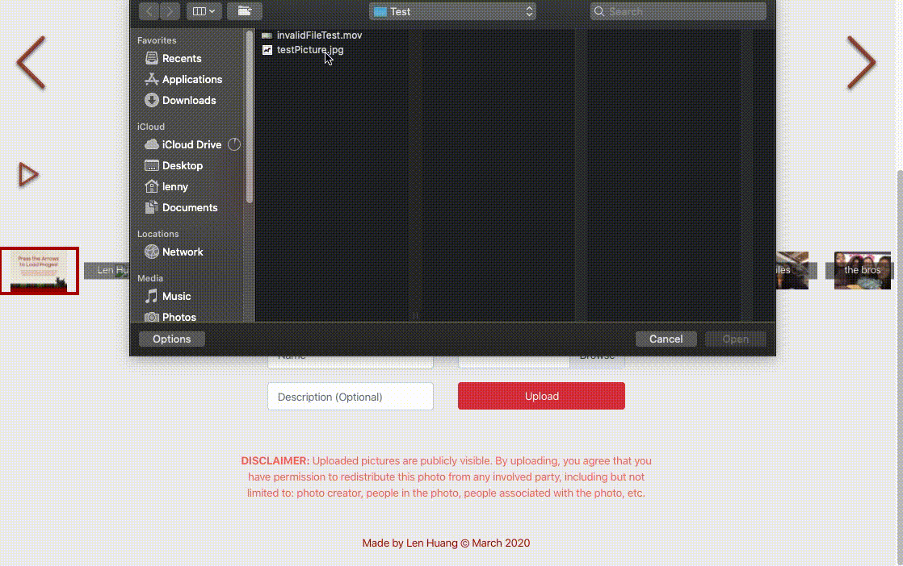

# CMU Image Share

Deployed Website: (https://lenghuang.github.io/cmu-imageshare)

Starting off as an idea from _CMU SCS First Year Advisor **Veronica Peet**_ (yay!) to foster a sense of community in the time of COVID-19, this web app allows anyone to upload images in a gallery for you friends to view **:-)**

## The How

#### Front End
These are some of the tools I used to assist me with creating the front end for this website:
- [Create React App](https://github.com/facebook/create-react-app)
- [React Boostrap](https://github.com/react-bootstrap/react-bootstrap)
- [React Image Gallery](https://github.com/xiaolin/react-image-gallery)

#### Back End
To implement the back end of this web app, I am using Google Firebase to:
- Store photos onto a storge bucket (Storage)
- Host image text data (Realtime Database)

## Demo

##### Viewing Images

##### Uploading Images

##### Error Handling

##### Cross-device Compatability Across Devices

## Reflections
I completed this project in around 48 hours in order to deploy it as soon as my advisor sent out an email about this image sharing idea. Her email was asking for what platform would be ideal for image sharing _(ie Facebook, Email, flickr, etc)_. Having heard this, I jumped at the idea of creating a platform that could be used by my classmates. This was a great way to teach myself popular technologies like the ReactJS framework and Google's firebase. Furthermore, I found myself thoroughly enjoying the process of making a webapp with a practical goal: _**unite our college community in a time of isolation.**_ 

In the (hopefully near) future, I want to add:
- Content filtering for SFW photos [via API calls to Clarifai](https://www.clarifai.com/models/nsfw-image-recognition-model-e9576d86d2004ed1a38ba0cf39ecb4b1)
- User authentication so that write access is limited to Carnegie Mellon related domains (Firebase/OAuth)
- Cloud functions to automatically clean storage by deleting files by age (Firebase)
- onClick handler to toggle presence of description boxes (CSS/sCSS)
